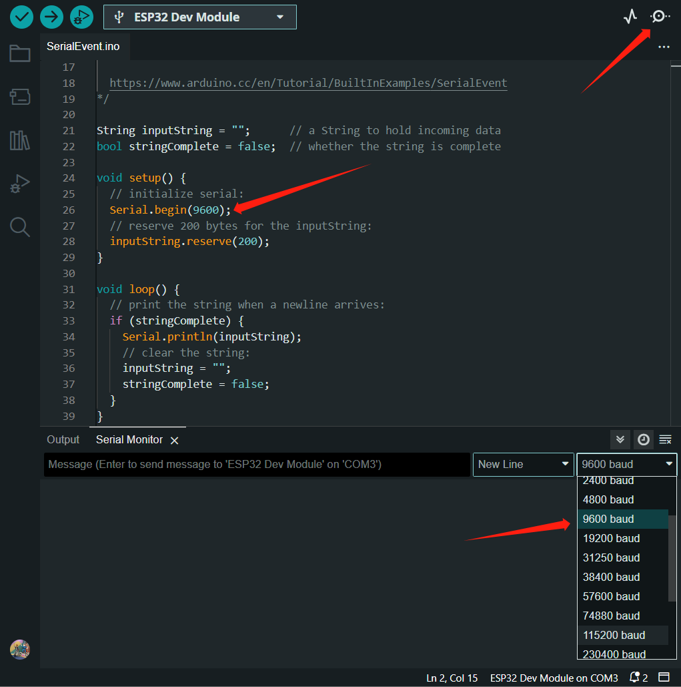

# 背景

家里买了电视之后，我的笔记本电脑就基本上一直连着电视，平常玩游戏躺沙发上用手柄玩，但是要学习或者工作的时候就需要键鼠了。可我还是想躺在沙发上，怎么办呢？在沙发上抱着键盘还勉强凑合，鼠标就不太方便了，所以想做一个空中鼠标，顺便学习一下嵌入式开发（从0开始学）。本人基础不是很好，写的教程有错误或者不足之处，请指（提）正（单）。

# 前言

> 空中鼠标，怎么做？我也不知道怎么做，我也不知道自己要学什么，我也不知道自己不知道什么，更不知道如何开始，那咋办？问，问谁？问ChatGpt。于是...

# 正文

## 解惑

我先问怎么学，用什么方法学：


首先可以确定的是，这个空中鼠标肯定和嵌入式、物联网有点啥关系，我再问：


总共就这四个阶段，那就一个阶段一个阶段来呗，但是我想先明确个方向，也就是我的最终目的是做出这个空中鼠标，然后我最开始上手的项目最好跟最终目标相关，于是我这样问祂：


这些板子咱也不知道啥是啥，祂推荐啥就用啥吧，开发板确定了，再确定一下项目：


再问问有没有现成的教程：


## 加购

我看了这几个教程，发现第三个最符合我的需求，基本上就是我要做的东西了，这里是[教程连接](https://diy-project.tistory.com/m/147)，是个韩国友人写的，谷歌翻译之后也能看懂，那就跟着买材料呗。清单如下：

* **ESP32-WROOM-32D或者叫ESP32 devkitc v4，都是一个东西，20块钱左右**

  
* **Micro USB线的话，连接开发板和电脑用的，3-4块钱**

  
* **MPU6050 三维角度传感器，10块钱左右**

  
* **面包板和跳线，图中的电源模块暂不需要，算上电源模块10块钱左右**

  

## 电路图


## 两个小坑

面包板有个小坑，我买的如图所示400孔的，但是把ESP32板子插在上面就没地方插跳线了，我也终于知道原作者为啥那样插板子了，幸亏买的套餐带电源模块，电源模块上有几个短接头，能让我把跳线插在ESP32悬空的引脚上。


后来我又多买了几个面包板，横着拼一起就好了（我猜原作者可能是嫌这样子太笨重）


再说说板子的坑，首先我的板子插到我的Win11电脑上，电脑不会自动安装驱动，需要手动下载，询问祂之后，我选择了[CP210x USB to UART Bridge VCP Drivers](https://www.silabs.com/products/development-tools/software/usb-to-uart-bridge-vcp-drivers)。


驱动安装好之后，再插上板子就可以在设备管理器的*端口*下面看到板子的端口（我的是COM3），这个端口在连接Arduino IDE时会用到。


## Arduino IDE安装

然后安装Arduino IDE，这个去[官网下载](https://www.arduino.cc/en/software)就好了，默认安装。

安装好Arduino IDE之后，打开Arduino IDE，Board选择ESP32 Dev Module


如果板子此时插在电脑上，Arduino IDE会自动识别出板子的端口号。

如果没有自动识别出来，请根据设备管理器里显示的端口号手动添加。


## Hello World

到这里环境就都搭建完成了，第一件事肯定是测一下板子能不能用，就像第一次学编程的Hello World程序，于是我让ChatGPT给我推荐了几个测试程序。


### 小灯闪烁它不闪

结果运行第一个小灯闪烁的程序我就报错了


问了一下ChatGPT，是因为示例代码里的这个 `LED_BUILTIN`没有被声明，就是没有设置开发板内置LED的引脚号是多少，于是我按照祂的回答，把 `LED_BUILTIN`设置为2。


修改代码后，确实不报错了，但是小灯就是不闪，ChatGPT说可能是因为我这块板子的内置LED的引脚号不是GPIO2，于是我从GPIO1一直试到GPIO29，小灯还是不闪，我崩溃了，又到网上去搜原因，最后在ESP32的[官方论坛](https://esp32.com/viewtopic.php?t=11248)找到了原因所在：**ESP32-WROOM-32D没有给用户控制的小灯，只有一个显示电源的**。


### 串行通信它多说

在运行第二个示例代码Serial Event的时候，代码中初始化Serial Monitor的波特率为9600，但是Serial Monitor的默认波特率为115200，所以在测试的时候要把Serial Monitor的波特率改成9600才能正常通信。



然后就是个人对示例代码的一点小改动，示例代码会把你输入的回车也打印出来，但是我不想让它打印回车，于是做了小小改动。


## 不能debug

既然代码都能正常跑，那能不能debug调试呢？反正我这板子不能，debug报错，问了ChatGPT，最后也没解决，我猜可能还是驱动的问题，别人的板子插上电脑之后都能自动下载俩驱动，我这一个也没自动下载，端口那个驱动我是自己安装的，另一个驱动我也不知道是啥，也打不上，找了很多驱动都打不上，我还安装了[ESP32的官方IDE](https://docs.espressif.com/projects/esp-idf/zh_CN/latest/esp32/get-started/index.html)，最后都没解决，如果有大佬知道解决办法请告诉我，感谢，还好对后续的实践影响不大。


## 代码结构

根据示例的代码，顺便跟ChatGPT学习了一下Arduino代码的代码结构


## 复现代码

既然板子的关键功能都正常，那么我们直接复现原作者的代码

```C
#include <Wire.h>
#include <SPI.h>
#include <SoftwareSerial.h>
#include <BleMouse.h>

uint8_t data[6];
int16_t gyroX, gyroZ;
 
int Sensitivity = 600;
int delayi = 20;

BleMouse bleMouse;

uint32_t timer;
uint8_t i2cData[14];
 
const uint8_t IMUAddress = 0x68;
const uint16_t I2C_TIMEOUT = 1000;
 
uint8_t i2cWrite(uint8_t registerAddress, uint8_t* data, uint8_t length, bool sendStop) {
  Wire.beginTransmission(IMUAddress);
  Wire.write(registerAddress);
  Wire.write(data, length);
  return Wire.endTransmission(sendStop); // Returns 0 on success
}

uint8_t i2cWrite2(uint8_t registerAddress, uint8_t data, bool sendStop) {
  return i2cWrite(registerAddress, &data, 1, sendStop); // Returns 0 on success
}
 
uint8_t i2cRead(uint8_t registerAddress, uint8_t* data, uint8_t nbytes) {
  uint32_t timeOutTimer;
  Wire.beginTransmission(IMUAddress);
  Wire.write(registerAddress);
  if(Wire.endTransmission(false))
    return 1;
  Wire.requestFrom(IMUAddress, nbytes,(uint8_t)true);
  for(uint8_t i = 0; i < nbytes; i++) {
    if(Wire.available())
      data[i] = Wire.read();
    else {
      timeOutTimer = micros();
      while(((micros() - timeOutTimer) < I2C_TIMEOUT) && !Wire.available());
      if(Wire.available())
        data[i] = Wire.read();
      else
        return 2;
    }
  }
  return 0;
}

void setup() {
  Wire.begin();

  i2cData[0] = 7;
  i2cData[1] = 0x00;
  i2cData[3] = 0x00;

  while(i2cWrite(0x19, i2cData, 4, false));
  while(i2cWrite2(0x6B, 0x01, true));
  while(i2cRead(0x75, i2cData, 1));
  delay(100);
  while(i2cRead(0x3B,i2cData,6));
 
  timer = micros();
  Serial.begin(115200);
  bleMouse.begin();
  delay(100);
}

void loop() {
  while(i2cRead(0x3B,i2cData,14));
 
  gyroX = ((i2cData[8] << 8) | i2cData[9]);
  gyroZ = ((i2cData[12] << 8) | i2cData[13]);
 
  gyroX = gyroX / Sensitivity / 1.1  * -1;
  gyroZ = gyroZ / Sensitivity  * -1;

  if(bleMouse.isConnected()){
    Serial.print(gyroX);
    Serial.print("   ");
    Serial.print(gyroZ);
    Serial.print("\r\n");
    bleMouse.move(gyroZ, -gyroX);
  }
  delay(delayi);
}
```

### 安装库

把代码复制过来之后，安装两个库就可以跑起来了

#### SoftwareSerial库安装

这个在Arduino IDE的Library Manager里就搜得到


#### BLE 鼠标库安装

* **下载库**：

  - 打开提供的链接：[ESP32-BLE-Mouse](https://github.com/T-vK/ESP32-BLE-Mouse/releases/tag/0.3.1)。
  - 在页面的"Assets"部分，找到 `ESP32-BLE-Mouse.zip`文件并点击它进行下载。
* **安装库**：

  - 打开Arduino IDE。
  - 在菜单栏中，选择 `草图` -> `包含库` -> `添加 .ZIP 库...`。
  - 在弹出的文件选择对话框中，找到并选择你刚刚下载的 `ESP32-BLE-Mouse.zip`文件。
  - 点击“打开”或“确定”按钮。Arduino IDE将自动解压并安装该库。

### 上传代码

点击Upload将代码上传到开发板，出现如图字样说明代码上传成功


这时应该可以在电脑的蓝牙下面发现这个**ESP32 Bluetooth Mouse**，连接成功后就可以变成鼠标控制电脑了


